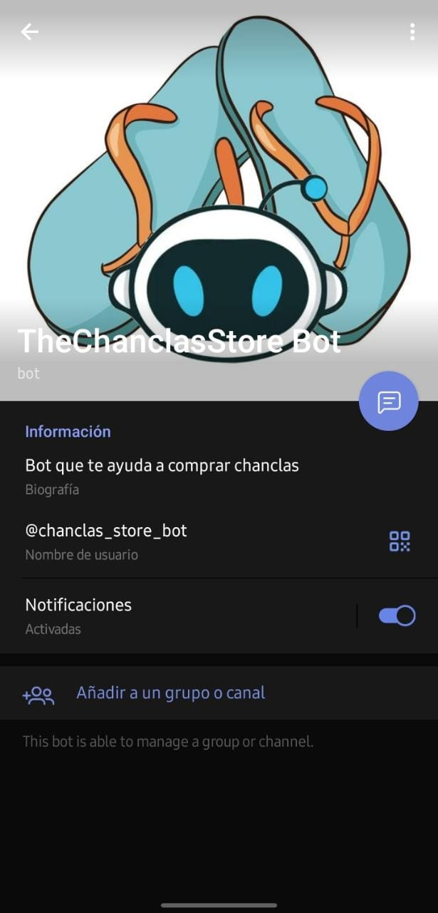
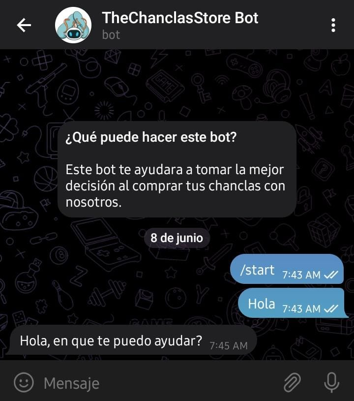

# CHATBOT Project (TELEGRAM)
## Descripción
#### Realizado Junio 2022

El siguiente proyecto fue realizado para la creación y implementación de un ChatBot, basado en inteligencia artificial construido en Python que hace posible generar respuestas.

Un pequeño **ejemplo** de lo que haria el chatbot:

> * **Usuario**: Hola!
> * **Bot**: Hola, en que puedo ayudarte.!
> * **Usuario**: Busco un par de chanclas
> * **Bot**: Claro, con gusto te ayudo...


## Como Funciona

Es una instancia que cada vez que el usuario ingresa una declaración a medida que el Chatbot recibe esta información aumenta la cantidad de respuestas que puede responder  y la precisión de cada una de estas que van en relacion con la declaración que hizo el usuario. Este programa va seleccionar una de las respuestas que se acomode a la relacion que pregunto el usuario, luego este devuelve una respuesta más probable.

> Comprar un par de chanclas!
   


## Datos del ChatBot 
Este viene con un módulo de utilidad de datos que se puede usar para los bots de chat.
* El archivo ConstantsEnvLocal es un archivo similar a este pero si lo importa al principio,
las constantes son las mismas y el contenido se coloca entre comillas, por ejemplo API_KEY='your_bot_token'.


```
import ConstantsEnvLocal as keys

BOT_NAME = keys.BOT_NAME
API_KEY = keys.API_KEY
ENV = keys.ENV  # This can be 'dev' or 'prod'
```


## Construido con:

| Feature  | Install |
| ------------- | ------------- |
| Python   | ✅  |
| MySQL  | ✅  |
| Digital Ocean  | ✅  |
| Telegram  | ✅  |
| API  | ✅  |


## Visualización del App en Telegram
### ¿Como usar el chatbot en Telegram?
> Escribe un mensaje en telegram con el que vinculaste con el BOT




### Preguntar al BOT
> Puedes interactuar con el bot ejemplo al escribir __hola__ y el bot debe responderte! de esta manera.



## Autores

* Robinson Hafid Roca
* Jose Eduardo León
* Shirley del Rosario Cux
* Juan Carlos Alvarado


## Historia 
Consulte las notas de la versión para ver el proyecto (https://github.com/3rrhe/ATI-Chatbot.git) 


## License 
ChatBot is licensed under the BSD 3-clause license.
